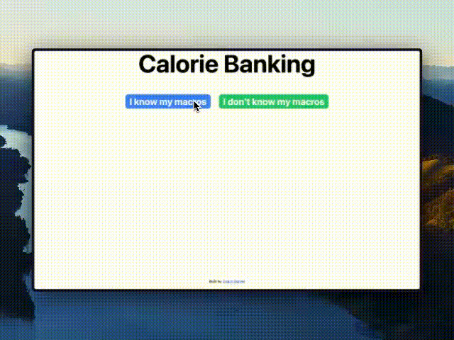

<p align="center">
  
</p>

# Calorie Banking

Calorie Banking is a web-based tool built with React that helps you flexibly distribute your weekly calorie intake by "banking" calories from one day to use on another. Perfect for people who want to have higher calorie days (e.g., for social events) without breaking their weekly calorie goals.

## How It Works

Calorie Banking applies the principle that your body responds to caloric balance over time, not just daily intake. Instead of rigidly sticking to the same calorie target every day, this app lets you:

1. Decrease calories on some days
2. "Bank" those calories for other days
3. Maintain the same weekly total

When you adjust one day's intake, the app automatically redistributes calories across other days, keeping your weekly total and protein levels constant.

## Features

- **Automatic Calorie & Macro Calculation**: Enter your age, height, weight, activity level, and sex to have your daily needs calculated automatically.

- **Manual Macro Input**: Already know your macros? Enter them directly.

- **Protein-First Approach**: The app maintains your protein intake (based on bodyweight) while adjusting carbs and fats.

- **Customizable Protein Targets**: Select protein intake from 1.3g to 2.3g per kg of bodyweight.

- **Flexible Carb/Fat Distribution**: Choose how to split your remaining calories between carbohydrates and fats.

- **Interactive Bar Chart**: Visually see and adjust your daily calorie distribution.

- **Day Locking**: Lock specific days so they remain untouched when other days are adjusted.

- **Adjustable Slider**: Fine-tune each day's calories with an easy slider interface.

- **Sharing Options**: Copy your plan to clipboard or share directly to WhatsApp to send to friends or nutrition coaches.

- **Reset Option**: Easily revert to your original even distribution if needed.

## Usage

1. Choose whether you know your macros or need them calculated
2. If calculating:
   - Enter your personal details (age, sex, weight, height, activity level)
   - Select your protein intake per kg of bodyweight
   - Choose your preferred carb/fat ratio
3. Use the interactive chart to:
   - Click on any day to select it
   - Adjust the slider to change that day's calories
   - Lock/unlock days as needed
4. Share your plan with others or reset to start over

## Technical Notes

- Built with React and TypeScript
- Uses Recharts for data visualization
- Implements Tailwind CSS for styling
- Calculates BMR using standard formulas
- Ensures macronutrient balance is maintained when redistributing calories
- Guarantees minimum essential fat intake even on lower calorie days
- Currently works with metric measurements (kg/cm)

## Installation

```
npm i
npm run dev
```

Or use the hosted version at: https://dnielgonzlz.github.io/calorie-banking/

## Support the Developer

If you find this tool useful, consider [buying the developer a coffee](https://www.buymeacoffee.com/danielgonzalez).

Built by [Coach Daniel](https://www.instagram.com/lift_with_daniel/)
